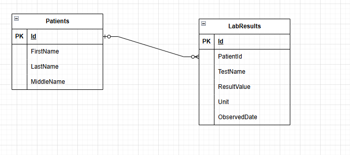

# LabResultsService

A small ASP.NET Core Web API for recording and retrieving patient lab results, backed by
SQL Server via EF Core. Built as a take-home exercise; the emphasis is on clean layering,
predictable HTTP semantics, and awareness of sensitive healthcare data.

## Contents

- [What it does](#what-it-does)
- [Tech stack](#tech-stack)
- [Solution layout](#solution-layout)
- [Getting started](#getting-started)
- [Configuration](#configuration)
- [Running the API](#running-the-api)
- [API reference](#api-reference)
- [Data model](#data-model)
- [SQL artifacts](#sql-artifacts)
- [Error handling contract](#error-handling-contract)
- [Logging](#logging)
- [Tests](#tests)
- [Useful commands](#useful-commands)
- [Design considerations](#design-considerations)

## What it does

- Create a patient record.
- Record a lab result for an existing, active patient.
- Fetch a single lab result by id.
- List lab results for a patient, optionally including soft-deleted rows.
- Update a lab result (PATCH-style: only supplied fields are applied).
- Soft-delete a lab result (`IsActive = false`; the row is retained for audit).

There is intentionally no endpoint to read, update, or deactivate a patient — patients are
seed/reference data for this exercise.

## Tech stack

| Concern | Choice |
|---|---|
| Runtime | .NET 10, ASP.NET Core Web API (controllers) |
| Persistence | SQL Server + EF Core 10 (code-first migrations) |
| Validation | `System.ComponentModel.DataAnnotations` |
| Logging | Serilog (console + rolling JSON file), request logging |
| API docs | Swashbuckle / Swagger UI (Development only) |
| Tests | NUnit, Moq, AutoFixture |
| Packaging | Central Package Management (`Directory.Packages.props`) |

## Solution layout

`LabResultsService.slnx`

| Project | Responsibility | Depends on |
|---|---|---|
| `LabResultsService.API` | HTTP surface: controllers, Swagger, Serilog wiring, `GlobalExceptionHandler`, composition root | Services, Repository |
| `LabResultsService.Services` | Application logic: DTOs, validation, entity↔DTO mapping, orchestration | Repository, Core |
| `LabResultsService.Repository` | EF Core `DbContext`, entity configuration, migrations, repository implementations | Core |
| `LabResultsService.Core` | Cross-cutting domain primitives (e.g. `ResourceNotFoundException`) | — |
| `tests/LabResultsService.Services.Tests` | Unit tests for the Services layer | Services |

Each layer exposes interfaces at its boundary and registers itself through an extension
method (`RegisterServices`, `RegisterContext`, `RegisterRepositories`) called from
`Program.cs`.

## Getting started

### Prerequisites

- .NET SDK 10.x (`dotnet --version` → `10.x`)
- SQL Server reachable from your machine (LocalDB, Developer edition, or a container)
- EF Core CLI: `dotnet tool install --global dotnet-ef`

### Setup

```bash
git clone https://github.com/vignesh-6145/LabResultsService.git
cd LabResultsService
dotnet restore
dotnet build
```

### Create the database

Option A — apply EF migrations:

```bash
dotnet ef database update --project .\src\LabResultsService.Repository\ --startup-project .\src\LabResultsService.API\
```

Option B — run the checked-in script (schema + sample rows):

```bash
sqlcmd -S localhost -i .\Database\schema.sql
```

## Configuration

Settings are read from `appsettings.json` / `appsettings.{Environment}.json` and standard
ASP.NET Core configuration providers. For local development, prefer
`dotnet user-secrets` over editing `appsettings.json`.

| Key | Purpose | Default (dev) |
|---|---|---|
| `ConnectionStrings:DefaultConnection` | SQL Server connection string. **Required** — the app throws at startup if missing. | `Server=localhost;Database=LabResultsDb;Trusted_Connection=True;TrustServerCertificate=True;` |
| `Serilog:*` | Sinks, minimum levels, enrichers | Console + `./logs/log-*.json`, daily rollover, 14 files retained |

```bash
dotnet user-secrets set "ConnectionStrings:DefaultConnection" "Server=...;Database=LabResultsDb;..." --project .\src\LabResultsService.API
```

## Running the API

```bash
dotnet run --project .\src\LabResultsService.API
```

| Profile | URL |
|---|---|
| http | http://localhost:5059 |
| https | https://localhost:7068 |

- Swagger UI (Development only): `/swagger`
- All endpoints are anonymous. `app.UseAuthorization()` is wired but no authentication
  scheme is configured.

## API reference

Base path: `/api`

| Method | Route | Body | Success | Notes |
|---|---|---|---|---|
| `POST` | `/Patients/createAPatientRecord` | `CreatePatientDTO` | `200 OK` + patient `Guid` | Non-REST route name (kept for compatibility with the exercise) |
| `POST` | `/LabResults` | `RecordLabResultDTO` | `200 OK` + lab result `Guid` | Patient must exist and be active |
| `GET` | `/LabResults/{id}` | – | `200 OK` + `LabResult` | `404` if not found |
| `GET` | `/LabResults?patientId={guid}&includeDeletedRecords={bool}` | – | `200 OK` + `LabResult[]` | `includeDeletedRecords` defaults to `false` |
| `PUT` | `/LabResults/{id}` | `UpdateLabResultDTO` | `200 OK` | Only non-null / non-whitespace fields are applied |
| `DELETE` | `/LabResults/{id}` | – | `200 OK` | Soft delete (`IsActive = false`); idempotent |

DTO shapes and per-field validation rules are enumerated in
[`TEST_SCENARIOS.md`](TEST_SCENARIOS.md), which also documents the full scenario matrix
(happy paths, validation failures, not-found, malformed input, DB-down) for every endpoint.

### Validation summary

- `RecordLabResultDTO`: `PatientId`, `TestName`, `ResultValue`, `Unit` required;
  `TestName` ≤ 128, `ResultValue` ≤ 256, `Unit` ≤ 32; `ObservedDate` optional
  (defaults to `DateTime.Now`).
- `CreatePatientDTO`: `FirstName`, `LastName` required (5–126 chars); `MiddleName` optional.
- Ids are parsed with `GuidUtils.ParseGuidOrThrow` — malformed or all-zero GUIDs → `400`.

## Data model

```
Patient (1) ──< LabResult (many)
```



**Patient**

| Column | Type | Notes |
|---|---|---|
| `Id` | `uniqueidentifier` | PK |
| `FirstName` | `nvarchar(126)` | required |
| `MiddleName` | `nvarchar(126)` | nullable |
| `LastName` | `nvarchar(126)` | required |
| `IsActive` | `bit` | default `1`; soft-delete / active flag |

**LabResult**

| Column | Type | Notes |
|---|---|---|
| `Id` | `uniqueidentifier` | PK |
| `PatientId` | `uniqueidentifier` | FK → `Patients.Id`, indexed, `ON DELETE CASCADE` |
| `TestName` | `nvarchar(128)` | required |
| `ResultValue` | `nvarchar(256)` | required |
| `Unit` | `nvarchar(32)` | required |
| `ObservedDate` | `datetime2` | required — time the specimen was observed |
| `IsActive` | `bit` | default `1`; soft-delete flag |

## SQL artifacts

[`Database/schema.sql`](Database/schema.sql) contains the full DDL (generated from EF
migrations) plus sample `INSERT` rows for two patients and four lab results.

Example queries:

```sql
-- Filter: active lab results for one patient within a date range
SELECT Id, TestName, ResultValue, Unit, ObservedDate
FROM   dbo.LabResults
WHERE  PatientId = @patientId
  AND  IsActive = 1
  AND  ObservedDate >= @from
  AND  ObservedDate <  @to
ORDER BY ObservedDate DESC;

-- Aggregation: number of active results per patient
SELECT  p.Id, p.LastName, p.FirstName, COUNT(l.Id) AS ResultCount
FROM    dbo.Patients p
LEFT JOIN dbo.LabResults l
       ON l.PatientId = p.Id AND l.IsActive = 1
GROUP BY p.Id, p.LastName, p.FirstName
ORDER BY ResultCount DESC;
```

## Error handling contract

- `[ApiController]` returns `400` + `ValidationProblemDetails` automatically on model-state
  failures.
- Controllers catch known exceptions and translate them:
  - `ArgumentNullException`, `InvalidDataException` → `400 Bad Request`
  - `ResourceNotFoundException` (from `Core`) → `404 Not Found`
- Anything uncaught is handled by `GlobalExceptionHandler` → `500` +
  `application/problem+json` (RFC 7807).

See [Design considerations](#design-considerations) for the trade-off being made here.

## Logging

Serilog is configured from `appsettings.json`:

- Console sink + rolling compact-JSON file sink under `./logs/` (daily, 100 MB cap,
  14 files retained).
- `UseSerilogRequestLogging()` emits one structured line per HTTP request.
- Enrichers: log context, machine name, process id, thread id.
- EF Core command logging is capped at `Warning`.
- Log messages reference record ids and *which* fields changed — not patient-identifying
  values or result data.

## Tests

```bash
dotnet test
```

Unit tests target the Services layer (`SoftDeleteLabResultAsync`,
`FilterLabResultsByPatientIdAsync`) with mocked repositories. NUnit + Moq + AutoFixture.

## Useful commands

```bash
# Add a migration
dotnet ef migrations add <MigrationName> --project .\src\LabResultsService.Repository\ --startup-project .\src\LabResultsService.API\ -o Data/Migrations

# Apply migrations to the database
dotnet ef database update --project .\src\LabResultsService.Repository\ --startup-project .\src\LabResultsService.API\

# Regenerate the schema script
dotnet ef migrations script --project ./src/LabResultsService.Repository --startup-project ./src/LabResultsService.API --output ./Database/schema.sql
```

## Design considerations

### DataAnnotations over FluentValidation

Given the scale, the built-in DataAnnotations are sufficient. They cover the static,
single-field rules this API needs and require no extra dependency. FluentValidation would
earn its place once cross-entity or conditional rules appear.

### Global exception handling vs. per-controller `catch`

`GlobalExceptionHandler` + `AddProblemDetails` produce RFC 7807 responses for anything
uncaught. On top of that, each controller action currently repeats the same `catch` blocks
to map known exceptions to `400` / `404`. This deliberately violates DRY for now; the
intended direction is to centralize the mapping — either by moving
`ResourceNotFoundException → 404` and domain-validation → `400` into the handler, or with
result-filter attributes such as `[BadRequestOnArgumentNullException]` — so controllers
just `await` and return.

### Custom exceptions

`ResourceNotFoundException` (in `Core`) signals "entity not found" across layers. It is
generic but fulfils its single responsibility and keeps the not-found path explicit rather
than relying on nullable returns everywhere.

### Soft delete

Lab data is not hard-deleted. `DELETE` sets `IsActive = false`; list queries exclude
inactive rows unless `includeDeletedRecords=true`. This preserves an audit trail, which
matters for healthcare data. (Enforcement is currently split between the query and an
in-memory filter — consolidating it behind an EF `HasQueryFilter` is on the roadmap.)

### Manual model mapping

Entity↔DTO mapping is hand-written (`ModelMapper/*`). The mappings are trivial, and explicit
code avoids a mapping dependency and reflection cost while making the field-by-field
transforms (including trimming) obvious.

### DTOs at every boundary

Entities are never bound from or returned directly to clients; each operation has its own
DTO. This decouples the wire contract from the persistence model and lets create vs. update
carry different nullability and validation.

### Why EF Core

Code-first migrations make schema evolution cheap, and the provider abstraction keeps the
door open if the data source changes later. Setup was markedly simpler than the
alternatives considered.
